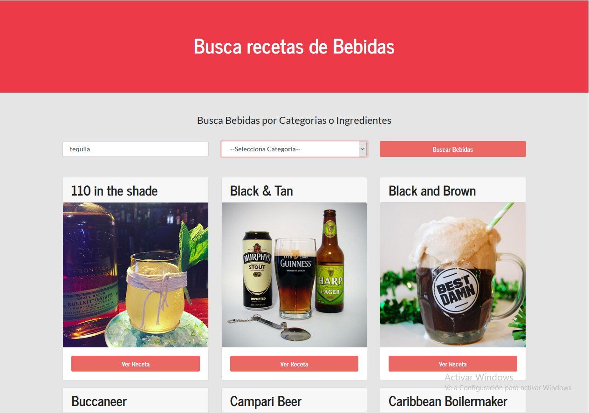
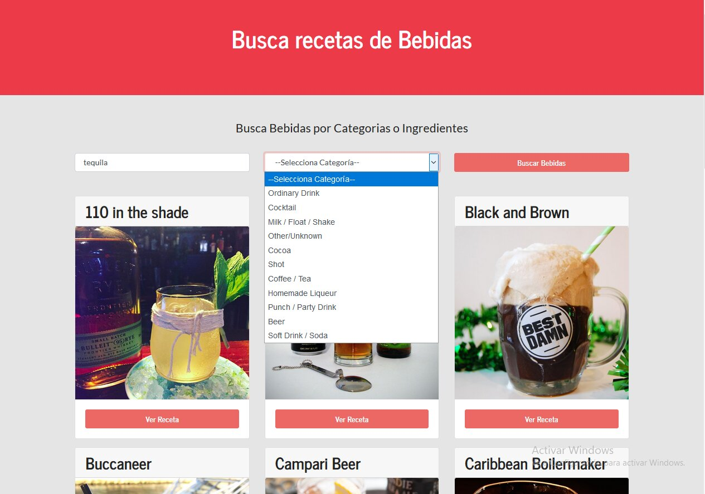
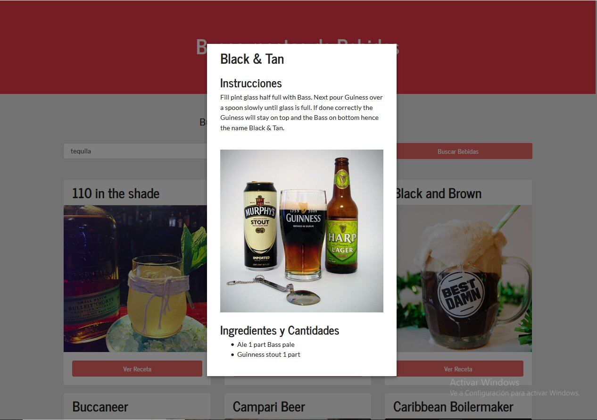

# Aplicación Buscador de Preparacion de Cocktails

\_Aplicación realizada con React y Material-UI - Utiliza la Api Context

### Instalación 🔧

Una vez clonado se pueden instalar las dependencias de la siguiente forma.

```
Yarn install o NPM install
```

y

```
Yarn start o NPM start
```

## Construido con 🛠️

- [Expo](http://reactjs.org) - Framework
- [Yarn](https://yarnpkg.com/) - Manejador de dependencias
- [Material-UI](https://material-ui.com) - Mateiral-UI Modal
- [Api](https://www.thecocktaildb.com/api.php) - Api Cocktails

## Preview 📌





## Autores ✒️

- **Gabriel Paez** - _Trabajo Inicial_ - [GABPAEZ](https://github.com/GabPaez)

## Licencia 📄

Este proyecto está bajo la Licencia (Tu Licencia) - mira el archivo [LICENSE.md](LICENSE.md) para detalles
